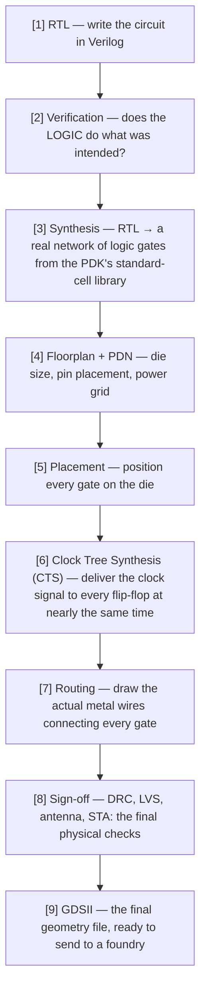

# From RTL to Silicon: The Chip-Making Flow, A to Z

| | |
|---|---|
| **Program** | HUFLIT Open Silicon (codename Vega) |
| **Worked example** | [`designs/counter3/`](../designs/counter3/) — see the full run in [`docs/counter3-technical-report.md`](counter3-technical-report.md) |
| **Audience** | Anyone new to physical chip design who has run (or watched) a LibreLane flow and wants to know what actually happened |
| **Status** | Concept/teaching reference — not a program milestone |
| **Vietnamese version** | [`docs/vi/chip-making-a-to-z.md`](vi/chip-making-a-to-z.md) |

## Why this document exists

Running `librelane -p sky130A -s sky130_fd_sc_hd config.yaml` and watching
it print "Flow complete" after a few minutes does not, by itself, explain
*what just happened*. This document walks through the whole RTL-to-GDSII
flow conceptually, stage by stage, grounded in the actual numbers from the
program's first design (`counter3`, a 3-bit synchronous up-counter) rather
than generic textbook figures.

## 1. The whole journey, at a glance

A useful analogy: **RTL** is a sketch of an idea ("a house with two
floors, this many rooms"). The final **GDSII** file is a construction-grade
blueprint, detailed down to the position of every brick — precise enough
that a contractor needs no further input. Everything between those two
points is called **physical design**, or the **RTL-to-GDSII flow**.

## 2. What a single LibreLane invocation actually runs

The command `librelane -p sky130A -s sky130_fd_sc_hd config.yaml` is
**stages [3] through [9] above, chained into one automated pipeline**.
LibreLane does not do the work itself — it orchestrates several
specialized tools, one per stage group:

| Stage group | Tool underneath | Job |
|---|---|---|
| Synthesis | **Yosys** | RTL → network of logic gates |
| Floorplan / Placement / CTS / Routing | **OpenROAD** | All physical layout |
| Physical sign-off | **Magic + KLayout + Netgen** | Final checks |

For `counter3`, this chain completed **76 of 76 sub-stages, zero errors**,
producing a 100µm × 100µm die containing 112 functional cells (3
flip-flops for the counter bits plus a handful of combinational gates),
616 "fill cells" (pure spacing, no logic), and 90 tap/endcap cells
(latch-up prevention). Each stage hands a snapshot of the design state to
the next one — that is why nothing needs manual intervention in between.

## 3. "RTL verification" is not the same thing as "checking the connections" — two different layers

This distinction matters more than any single stage name: there are **two
entirely different kinds of checking**, happening at two different points
in the flow above.

### (A) RTL verification = does the LOGIC do what was intended?

This happens at stage [2], **before** anything physical exists at all.
For `counter3`: a Python testbench (`cocotb`) drives simulated clock/reset
signals and asserts "after reset is released, `count` must cycle
0→1→2→...→7→0 correctly." This is purely a check of meaning, run inside a
simulator (Verilator) — **no physical shape is involved yet**. This stage
also caught a real gotcha: an early version of the test failed
intermittently not because the RTL was wrong, but because the test
assumed a driven signal takes effect on the very next clock edge — a
simulator-scheduling detail, not an RTL bug (full write-up:
`docs/counter3-technical-report.md` §4.1). Lesson: **correct RTL does not
guarantee a correctly written testbench.**

### (B) "Checking the connections, looking for violations" — this is stage [8], after physical layout exists

- **LVS (Layout Versus Schematic)** — compares "the network of gates we
  intended to build" (the netlist) against "the shape that was actually
  drawn" (the layout) — do they match exactly, with no missing, extra, or
  swapped connection.
- **DRC (Design Rule Check)** — checks whether the geometry obeys the
  foundry's manufacturing rules (minimum spacing between two metal wires,
  minimum width, and so on). A foundry can only fabricate a layout that is
  legal under its own rule deck.
- **Antenna check** — a specific physical effect: during fabrication, a
  long metal wire not yet connected to a transistor can accumulate static
  charge and damage the delicate gate oxide when it eventually discharges
  into the transistor. This check ensures no wire is left in that exposed
  state.
- **STA (Static Timing Analysis)** — checks speed: at the chosen clock
  rate (10ns = 100MHz for `counter3`), does a signal have enough time to
  travel from one flip-flop to the next before the following clock edge
  ("setup"), and does it not arrive too early and corrupt the previous
  value ("hold"). `counter3` had +4.96ns of setup margin to spare — the
  design runs far faster than 100MHz; that target was chosen deliberately
  low to make first-run sign-off easy.

All four checks came back **zero violations** for `counter3`.

## 4. The final product — GDSII — what it actually is

GDSII (`counter3.gds`, ~270KB) is a **pure geometry file**: every physical
layer of the chip (diffusion, poly, metal1, metal2, via layers, and so
on) is described as thousands of polygons, with coordinates precise to
the nanometer. There is no more concept of "logic" or "Verilog" left in
this file — it is purely geometric, much like a highly detailed
mechanical CAD drawing.

**Why it matters:** this is the industry-standard format that **every
semiconductor foundry in the world can read**, independent of whichever
tool produced it. From this file, a foundry generates a set of
**photomasks** (one optical mask per physical layer), used in
photolithography to "print" each layer onto a real silicon wafer.

## 5. When does the final GDSII actually go to a foundry to be etched?

**Short answer for this program: not yet, deliberately.** This is a
recorded decision — `docs/decisions/ADR-OS-003-no-tapeout-first-12-months.md`
("no tape-out in the first 12 months"). Rationale: running the complete
RTL-to-GDSII flow with full sign-off, as `counter3` did, already captures
roughly 90% of the learning value at near-zero cost. Actually submitting
a design to a foundry ("tape-out") costs real money and takes **9–14
months of turnaround** — worth doing only once a design has real value to
prove on silicon, which a 3-bit counter clearly does not.

**What the real tape-out process looks like**, for when this program
eventually reaches that point:

1. Submit the GDSII to a foundry (often via a **shuttle/MPW — Multi
   Project Wafer**, which bundles many small designs from different
   teams onto one shared wafer to split the cost, since a single wafer
   has room for hundreds of small designs).
2. The foundry generates masks and manufactures the actual wafer through
   many rounds of photolithography — a process that takes months.
3. The wafer is diced into individual dies and packaged.
4. Dies are tested on automated test equipment (ATE), comparing
   real-silicon behavior against what simulation predicted.

Several low-cost paths already exist in the open-silicon ecosystem for
when this program is ready to consider that step (surveyed as recently
as ORConf 2026, September 2026): **IHP** offers a free MPW allocation for
non-commercial open-source designs under 2mm² on its SG13G2 PDK; **Tiny
Tapeout** and **wafer.space** (from $2,000 per 1,000 dies, on GF180MCU)
are active cost-sharing shuttle channels. Not out of reach in principle —
simply not yet the right time.

## References

- `docs/counter3-technical-report.md` — the full worked example this
  document is grounded in
- `docs/decisions/ADR-OS-001-librelane-not-openlane.md`,
  `ADR-OS-003-no-tapeout-first-12-months.md`
- `docs/OPEN_SILICON_KICKOFF.md` §2.1 (toolchain), §2.2 (PDKs), §5.2/§5.3
  (infrastructure)
- LibreLane documentation: `librelane.readthedocs.io`
- cocotb documentation: `docs.cocotb.org`
