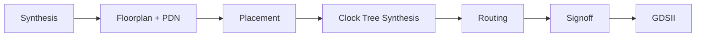

# counter3

**A First RTL-to-GDSII Design**

HUFLIT Open Silicon (Vega) — Phase 0, weeks 3-6
Full technical report: `docs/counter3-technical-report.md`

---

## Why This Exercise Exists

- Phase 0 skill ladder (`docs/OPEN_SILICON_KICKOFF.md` §4):
  1. Weeks 1-2 — toolchain smoke test (done)
  2. **Weeks 3-6 — full RTL-to-GDSII, own design (this talk)**
  3. Weeks 7-12 — real upstream PR (Gate 0)
- Goal: understand **why sign-off is the hard part**, not build a useful
  circuit.
- No tape-out submission (ADR-OS-003) — the GDSII is a learning artifact.

---

## Toolchain

| Component | Role |
|---|---|
| IIC-OSIC-TOOLS (Docker) | Bundles the whole open-source EDA stack |
| Verilator + cocotb | RTL simulation, Python testbenches |
| LibreLane v3.1.0.dev3 | RTL -> GDSII flow (Step -> Flow -> State) |
| SKY130A / `sky130_fd_sc_hd` | Open PDK + standard cell library |

**Trap:** the container's ambient `$PDK` defaults to `ihp-sg13g2`, not
sky130A -- always pass `-p sky130A -s sky130_fd_sc_hd` explicitly.

---

## The Design

```verilog
module counter3 (
    input  wire       clk,
    input  wire       rst,
    output reg  [2:0] count
);
    always @(posedge clk) begin
        if (rst)
            count <= 3'b000;
        else
            count <= count + 3'b001;
    end
endmodule
```

Synchronous reset. Wrap-around is free (3-bit overflow truncation).

---

## Verification: cocotb + Verilator

Two tests:

1. `test_reset_clears_count` -- count is 0 while `rst` is held.
2. `test_counts_and_wraps` -- 16 cycles, each checked against the
   *previous* observed value: `expected = (previous + 1) % 8`.

**Result: 2/2 passing.**

---

## Gotcha #1 -- The Off-by-One That Wasn't an RTL Bug

- First version asserted an **absolute** claim: "count == 1 on the first
  cycle after reset release."
- Failed intermittently -- not an RTL bug.
- `dut.rst.value = 0` right after `await RisingEdge(...)` is **not
  guaranteed visible on the very next edge** (simulator scheduling).
- **Fix:** assert relative to the *previously observed* value, not an
  absolute cycle count.

---

## Physical Config: the Minimal Part

```yaml
DESIGN_NAME: counter3
VERILOG_FILES: dir::src/*.v
CLOCK_PERIOD: 10        # 10 ns = 100 MHz, deliberately conservative
CLOCK_PORT: clk
```

Everything past this is non-default -- and exists for one reason: **the
design is too small for LibreLane's defaults.**

---

## Gotcha #2 -- Floorplan/PDN Sizing for Tiny Designs

Default percentage-based sizing (`FP_CORE_UTIL`) computes too small a die
for a handful of cells once PDN straps + hold buffers need room:

1. `PDN-0185` -- insufficient strap width
2. `DPL-0036` -- detailed placement failed (if only #1 is patched)

**Fix:**

```yaml
FP_SIZING: absolute
DIE_AREA: [0, 0, 100, 100]
PDN_VOFFSET: 5
PDN_HOFFSET: 5
PDN_VWIDTH: 2
PDN_HWIDTH: 2
PDN_VPITCH: 30
PDN_HPITCH: 30
PDN_SKIPTRIM: true
```

Same values LibreLane's own `spm` example uses, same reason.

---

## Flow: 76 / 76 Stages, 0 Errors



---

## Results -- Cells & Area

| Metric | Value |
|---|---|
| Functional standard cells | 112 (3 seq + 6 comb + buffers) |
| Fill / tap cells | 616 / 90 |
| Die area | 100 x 100 um (10,000 um^2) |
| Core utilization | **5.24%** |

Fill cells alone (616 of 728 placed instances) outnumber logic (112) 5:1;
90 more tap/endcap cells sit alongside, tracked separately. Die is sized
for PDN headroom, not for these three flip-flops.

---

## Results -- Timing & Power

| Metric | Value |
|---|---|
| Target clock | 10 ns (100 MHz) |
| Worst setup slack (9 PVT corners) | +4.96 ns (met) |
| Worst hold slack (9 PVT corners) | +0.41 ns (met) |
| Setup / hold violations | 0 / 0 |
| Total power (nominal corner) | ~= 96.9 nW |

~5 ns of setup margin at a 10 ns period: 100 MHz was a conservative
target, not a limit this design was pushed against.

---

## Results -- Signoff

| Check | Result |
|---|---|
| Magic DRC / KLayout DRC | 0 errors |
| GDS-vs-layout XOR | 0 differences |
| LVS | 0 errors |
| Antenna violations | 0 |

Every checker in the flow log: **clear.**

---

## Three Lessons for the Next Design

| # | Symptom | Root cause | Fix |
|---|---|---|---|
| 1 | sky130 config ignored | Ambient `$PDK` = ihp-sg13g2 | Pass `-p sky130A -s sky130_fd_sc_hd` explicitly |
| 2 | `PDN-0185` -> `DPL-0036` | Default sizing too small for tiny designs | `FP_SIZING: absolute` + tuned PDN |
| 3 | Off-by-one test failure | Signal write-after-await not visible next edge | Assert relative to previous cycle |

**Pattern:** the flow fails *several stages later* than the real cause,
with an error that doesn't obviously point back to it.

---

## Reproducing This Result

```bash
docker compose -f docker/docker-compose.yml build
docker compose -f docker/docker-compose.yml run --rm \
  --workdir /workspace/designs/counter3/verify \
  librelane-dev --skip make
docker compose -f docker/docker-compose.yml run --rm \
  --workdir /workspace/designs/counter3 \
  librelane-dev --skip \
  librelane -p sky130A -s sky130_fd_sc_hd config.yaml
```

`runs/` is gitignored -- `config.yaml` + RTL are the source of truth.

---

## Where This Fits in the Roadmap

- Closes out **weeks 3-6** of Phase 0.
- Next: **weeks 7-12**, the actual Gate 0 -- an upstream PR merged before
  2026-12-13.
- Full detail: `docs/counter3-technical-report.md`, `backlog.md`.

---

## Questions?

`docs/counter3-technical-report.md` — full write-up
`wiki/librelane-config-for-tiny-designs.md` — floorplan/PDN deep dive
`wiki/docker-toolchain-invocation.md` — container invocation deep dive
