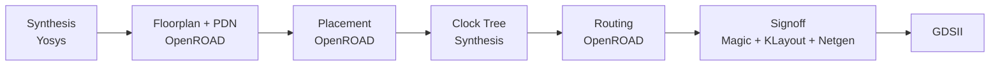

# counter3 — A First RTL-to-GDSII Design: Technical Report

| | |
|---|---|
| **Program** | HUFLIT Open Silicon (codename Vega) |
| **Design under study** | [`designs/counter3/`](../designs/counter3/) |
| **Milestone** | Phase 0, weeks 3-6 (`docs/OPEN_SILICON_KICKOFF.md` §4) |
| **Run date** | 2026-09-14 |
| **Status** | Complete: full DRC/LVS/timing sign-off. Not submitted for tape-out (ADR-OS-003) |
| **Audience** | Teaching material — first worked example of the RTL-to-GDSII flow for this program |

## Abstract

This report documents the first design taken through a complete
RTL-to-GDSII flow in the HUFLIT Open Silicon program: `counter3`, a 3-bit
synchronous up-counter. The design itself is intentionally trivial — the
point of this exercise, per the program's phase 0 roadmap, is not the
counter but everything *around* it: writing a correct testbench, driving
an open-source physical design tool (LibreLane) to a clean sign-off, and
understanding why sign-off — not RTL, not synthesis — is the hard part of
chip design. This report walks through the design, the verification
methodology, the physical implementation flow, the numerical results, and
three non-obvious problems encountered along the way, each with its root
cause and fix. It is written to be read by the next person or student
repeating this exercise.

## 1. Purpose and Context

The HUFLIT Open Silicon program's phase 0 (see
`docs/OPEN_SILICON_KICKOFF.md` §4) validates a single person against a
three-stage skill ladder before anything is scaled up:

1. **Weeks 1-2** — install the toolchain, run a smoke test. (Done: see
   `backlog.md`.)
2. **Weeks 3-6** — write a small original design and take it through the
   *full* flow with DRC, LVS, and timing sign-off. No shuttle submission.
   **This is the subject of this report.**
3. **Weeks 7-12** — find a real open-source IP missing verification, write
   a cocotb testbench, find a real bug, get a pull request merged upstream.
   This is Gate 0.

The explicit goal of step 2 is to understand *why sign-off is the hard
part*, not to produce a useful circuit. A 3-bit counter has no engineering
value on its own; its value here is entirely pedagogical. This is also why
the result is a GDSII file kept as local evidence and never submitted to a
shuttle (ADR-OS-003) — tape-out economics only make sense once a design has
actual value to prove on silicon.

## 2. Toolchain and Environment

| Component | Role |
|---|---|
| **IIC-OSIC-TOOLS** (Docker, JKU Linz) | Container bundling the entire open-source EDA toolchain used below |
| **Verilator** | RTL simulator |
| **cocotb** | Python-based testbench framework, classic Makefile flow |
| **LibreLane** (v3.1.0.dev3) | RTL-to-GDSII flow, FOSSi Foundation fork of OpenLane (see ADR-OS-001) |
| **SKY130A** (`sky130_fd_sc_hd`) | Open PDK and standard cell library used for this run |

LibreLane models a design as a sequence of **Steps** composed into a
**Flow**, each step transforming a **State** (a snapshot of every design
view — netlist, def, sdc, spef, etc.) and handing the next state to the
following step. Every step's configuration is captured in that snapshot, so
the same config plus the same tool versions is meant to reproduce the same
result bit-for-bit. This is why the repository commits `config.yaml` and
the RTL, but not the `runs/` directory: the run is regenerated from the
config, not stored as a binary artifact (see `.gitignore`).

**Toolchain trap worth flagging up front:** the container's ambient
default PDK environment variable is `ihp-sg13g2`, not `sky130A`, regardless
of what a design's `config.yaml` requests under a `pdk::sky130*:` block.
Those overrides are silently skipped if the wrong PDK is active — no
warning, no error. The flow must be invoked with the PDK named explicitly
on the command line:

```bash
docker compose -f docker/docker-compose.yml run --rm \
  --workdir /workspace/designs/counter3 \
  librelane-dev --skip \
  librelane -p sky130A -s sky130_fd_sc_hd config.yaml
```

See §6 for the full reproduction steps and [`wiki/docker-toolchain-invocation.md`](../wiki/docker-toolchain-invocation.md)
for more container invocation details.

## 3. RTL Design

The design under test, [`designs/counter3/src/counter3.v`](../designs/counter3/src/counter3.v):

```verilog
// 3-bit synchronous up-counter, synchronous active-high reset.
module counter3 (
    input  wire       clk,
    input  wire       rst,
    output reg  [2:0] count
);

    always @(posedge clk) begin
        if (rst)
            count <= 3'b000;
        else
            count <= count + 3'b001;
    end

endmodule
```

Two design choices are worth naming, because they are the kind of decision
a student should learn to state explicitly rather than leave implicit:

- **Synchronous, not asynchronous, reset.** `rst` is sampled on the clock
  edge like any other input. This is generally the preferred style for
  ASIC flows (it avoids adding a second, unclocked timing path for the
  reset release), at the cost of needing the clock to be running for reset
  to take effect — a fact that matters directly in §4.
- **Overflow as the wrap mechanism.** `count` is a 3-bit register; `count +
  3'b001` at `count == 3'b111` overflows and truncates back to `3'b000` for
  free, with no explicit wrap-around branch. This relies on Verilog's
  fixed-width arithmetic truncation and is worth pointing out precisely
  because it is easy to get wrong in a wider or signed design.

## 4. Verification

The testbench, [`designs/counter3/verify/test_counter3.py`](../designs/counter3/verify/test_counter3.py),
uses cocotb's classic Makefile flow against Verilator:

```
# designs/counter3/verify/Makefile
SIM ?= verilator
TOPLEVEL_LANG ?= verilog
VERILOG_SOURCES = $(shell pwd)/../src/counter3.v
TOPLEVEL = counter3
MODULE = test_counter3
include $(shell cocotb-config --makefiles)/Makefile.sim
```

Two tests were written:

1. **`test_reset_clears_count`** — holds `rst` high for two clock edges and
   asserts `count == 0` while it is held.
2. **`test_counts_and_wraps`** — releases reset, then checks 16 consecutive
   clock edges: each cycle's count must equal `(previous + 1) mod 8`.
   Sixteen cycles is twice the counter's period, so the test exercises the
   7-to-0 wraparound at least twice, not just once by chance.

Both tests pass (2/2). The design and verification of a design this small
would normally not be worth writing up in detail — except that the second
test's structure encodes a real methodology lesson, described next.

### 4.1 A non-obvious simulator timing gotcha

The first version of `test_counts_and_wraps` asserted an *absolute* claim:
"count equals 1 on the first clock edge after reset is released." That
assertion failed intermittently — not because the RTL was wrong, but
because of how the testbench itself was written. The reset helper
deasserts `rst` immediately after an `await RisingEdge(dut.clk)`:

```python
dut.rst.value = 0
await RisingEdge(dut.clk)
```

Writing a signal's `.value` right after an `await RisingEdge(...)` is
**not guaranteed to be visible to the DUT on the very next edge** — the
exact number of delta cycles before a driven value propagates is a
simulator-level scheduling detail, not something the RTL or the testbench
author controls directly. Treating "one cycle after I wrote this value" as
a hard guarantee produced an off-by-one failure that looked like an RTL
bug but was not one.

**Fix applied:** rewrite the assertion to be *self-referential* — each
cycle's expected value is derived from the *previously observed* value,
not from an assumed absolute cycle count tied to exactly when a
deasserted reset is presumed to take effect:

```python
previous = int(dut.count.value)
for _ in range(16):
    await RisingEdge(dut.clk)
    current = int(dut.count.value)
    expected = (previous + 1) % 8
    assert current == expected, f"expected {expected} after {previous}, got {current}"
    previous = current
```

**Teaching point:** when a cocotb test's timing assumption and the RTL's
actual behavior disagree, do not assume the RTL is at fault. Check whether
the test is asserting something about *simulator scheduling* rather than
about the *design's logical behavior*, and prefer assertions relative to
an observed reference point over assertions tied to an assumed absolute
cycle count.

## 5. Physical Implementation (LibreLane)

The full configuration, [`designs/counter3/config.yaml`](../designs/counter3/config.yaml):

```yaml
# Basics
DESIGN_NAME: counter3
VERILOG_FILES: dir::src/*.v
CLOCK_PERIOD: 10
CLOCK_PORT: clk

# Floorplan
FP_SIZING: absolute
DIE_AREA: [0, 0, 100, 100]

# PDN
PDN_VOFFSET: 5
PDN_HOFFSET: 5
PDN_VWIDTH: 2
PDN_HWIDTH: 2
PDN_VPITCH: 30
PDN_HPITCH: 30
PDN_SKIPTRIM: true

# Technology-Specific Configs
pdk::sky130*:
  CLOCK_PERIOD: 10.0
```

Three lines deserve explanation beyond what a config comment can hold:

- `VERILOG_FILES: dir::src/*.v` uses LibreLane's `dir::` glob prefix,
  resolved relative to the config file's own directory — it picks up every
  `.v` file under `src/` without listing them individually.
- `CLOCK_PERIOD: 10` sets a 10 ns (100 MHz) target clock. This is a
  deliberately conservative target for a design this small; §6 shows how
  much timing margin was actually left on the table.
- The `pdk::sky130*:` block is LibreLane's mechanism for PDK-conditional
  overrides — useful when a config must support more than one PDK, though
  in this case it only restates the same clock period already set above.

### 5.1 Why the floorplan and PDN blocks are non-default

Everything above the `# Floorplan` comment is close to a minimal LibreLane
config. Everything from `FP_SIZING` onward exists because **a design this
small breaks LibreLane's default, percentage-based floorplan sizing.**
`FP_CORE_UTIL` (the default sizing mode) computes a die area as a
percentage of the cells' combined footprint. For a handful of flip-flops
and gates, that computed die is too small once the power distribution
network (PDN) straps and post-clock-tree-synthesis hold-fix buffers need
room. Left at the defaults, the flow fails in two stages, in this order:

1. **`PDN-0185`** ("insufficient width to add straps") at PDN generation.
2. If only that is patched without addressing its root cause: **`DPL-0036`**
   ("detailed placement failed") later, when the resizer tries to insert
   hold buffers and finds nowhere legal to put them.

**Fix:** switch to `FP_SIZING: absolute` with a generously oversized
`DIE_AREA` (`[0, 0, 100, 100]`, i.e. 100 µm × 100 µm — see §6 for how sparse
this leaves the resulting layout), plus a widened PDN strap pattern
(`PDN_V/HOFFSET`, `PDN_V/HWIDTH`, `PDN_V/HPITCH`, `PDN_SKIPTRIM: true`).
These are the same non-default values LibreLane's own bundled `spm`
example uses, for the identical reason: `spm` is also small enough to hit
this class of problem. One syntax trap along the way: `DIE_AREA` must be a
YAML **list**, not a quoted string — a string is explicitly rejected by
LibreLane ("Refusing to automatically convert string at 'DIE_AREA' to
list"). Full write-up:
[`wiki/librelane-config-for-tiny-designs.md`](../wiki/librelane-config-for-tiny-designs.md).

### 5.2 Flow stages

The run that produced the results below (`RUN_2026-09-14_18-09-59`)
completed **76 of 76 flow stages with zero errors**. Grouped by phase:



Signoff (the last stage group) is where DRC, LVS, XOR, and antenna checks
run — see §6 for their results.

## 6. Results

Metrics below are pulled directly from
`designs/counter3/runs/RUN_2026-09-14_18-09-59/final/metrics.json` (not
committed — regenerate by re-running the flow per §7).

### 6.1 Cell counts and area

| Metric | Value |
|---|---|
| Flow stages completed | 76 / 76, 0 errors |
| Functional standard cells | 112 (3 sequential + 6 combinational + clock/hold-fix buffers) |
| Sequential cells (the counter's flip-flops) | 3 |
| Combinational cells | 6 |
| Clock buffers inserted | 4 |
| Hold-fix buffers inserted | 5 |
| Fill cells (density filler, no logic) | 616 |
| Tap/endcap cells (latch-up prevention) | 90 |
| Die area | 100 µm × 100 µm (10,000 µm²) |
| Core area | 6,761.48 µm² |
| Core utilization | 5.24% |

The utilization figure is the clearest illustration of §5.1's lesson: at
5.24% utilization, the vast majority of the die is empty on purpose —
sized for PDN and buffer routing headroom that three flip-flops do not
otherwise need. Fill cells alone (616 of the 728 total placed instances)
outnumber actual functional logic (112 cells) more than 5 to 1; another 90
tap/endcap cells sit in the layout alongside them, tracked as a separate
metric rather than folded into that 728 total.

### 6.2 Timing and power

| Metric | Value |
|---|---|
| Target clock period | 10 ns (100 MHz) |
| Worst-case setup slack (across all PVT corners) | +4.96 ns (met) |
| Worst-case hold slack (across all PVT corners) | +0.41 ns (met) |
| Setup / hold violations | 0 / 0 |
| Max slew / max capacitance / max fanout violations | 0 / 0 / 0 |
| Total power (nominal corner, 25 °C, 1.8 V) | ≈ 96.9 nW |
| — internal power | ≈ 79.3 nW |
| — switching power | ≈ 17.5 nW |
| — leakage power | ≈ 2.4 pW (negligible) |

Nine PVT (process/voltage/temperature) corners were checked in total
(typical/slow/fast process × three temperature-voltage points); all nine
report zero setup and hold violations. The nearly 5 ns of setup margin at
a 10 ns period is expected and intentional: 100 MHz is a conservative
target picked to make sign-off easy on a first run, not a target this
design was pushed to its limit against.

### 6.3 Routing and signoff

| Check | Result |
|---|---|
| Global route wirelength / vias | 607 / 121 |
| Detailed route wirelength / vias | 366 / 111 |
| Detailed routing DRC errors | 0 |
| Magic DRC errors | 0 |
| KLayout DRC errors | 0 |
| Magic illegal-overlap errors | 0 |
| GDS-vs-layout XOR differences | 0 |
| LVS (schematic vs. layout) errors | 0 |
| Antenna violations | 0 |

Every signoff checker in the flow log reports clean, in this exact order:
XOR clear → Magic DRC clear → KLayout DRC clear → illegal-overlap clear →
LVS clear → no setup violations → no hold violations → no max-slew
violations → no max-cap violations. The final GDSII
(`designs/counter3/runs/.../final/gds/counter3.gds`, ~270 KB) is kept as
local evidence only — it is gitignored, and is not a submission artifact
(ADR-OS-003).

## 7. Lessons for the Next Design

Three concrete, non-obvious problems were hit and resolved while producing
this result. Each is written up in full in `wiki/` for the next design to
avoid repeating the same trial-and-error:

| # | Symptom | Root cause | Fix |
|---|---|---|---|
| 1 | Sky130 config silently ignored; wrong technology library used | Container's ambient `$PDK` defaults to `ihp-sg13g2`, not `sky130A` | Pass `-p sky130A -s sky130_fd_sc_hd` explicitly on the `librelane` CLI, don't rely on the ambient default |
| 2 | `PDN-0185` then `DPL-0036` failures | Default percentage-based floorplan sizing computes too small a die for a handful of cells once PDN straps and hold buffers need room | `FP_SIZING: absolute` + explicit oversized `DIE_AREA`, plus PDN strap tuning (§5.1) |
| 3 | cocotb test intermittently off-by-one after reset release | Writing a signal's `.value` right after `await RisingEdge(...)` is not guaranteed visible on the very next edge (simulator scheduling, not an RTL bug) | Write test assertions relative to the previously observed value, not to an absolute cycle count |

The general pattern behind #1 and #2: **the flow does not fail loudly when
an assumption tuned for typical-sized designs breaks on an atypical one —
it fails several stages later, with an error that does not obviously point
back to the real cause.** Reading the actual stage where a step fails,
not just the top-level error message, is the debugging skill this exercise
was meant to build.

## 8. Reproducing This Result

```bash
# 1. Build the toolchain image (once)
docker compose -f docker/docker-compose.yml build

# 2. Run the cocotb testbench
docker compose -f docker/docker-compose.yml run --rm \
  --workdir /workspace/designs/counter3/verify \
  librelane-dev --skip make

# 3. Run the full LibreLane flow (PDK must be explicit -- see §2)
docker compose -f docker/docker-compose.yml run --rm \
  --workdir /workspace/designs/counter3 \
  librelane-dev --skip \
  librelane -p sky130A -s sky130_fd_sc_hd config.yaml

# 4. Inspect the result
ls designs/counter3/runs/RUN_*/final/gds/
cat designs/counter3/runs/RUN_*/final/metrics.json
```

The `runs/` directory this produces is gitignored by design: the
`config.yaml` and RTL are the reproducible source of truth, not the
generated binaries (see the Repository layout principles in
[`README.md`](../README.md)).

## 9. Relationship to the Program Roadmap

This result closes out weeks 3-6 of Phase 0
(`docs/OPEN_SILICON_KICKOFF.md` §4). `counter3` is a possible first of
several small learning designs — a UART is the other one the kickoff doc
names — but is already sufficient to satisfy the week 3-6 deliverable on
its own. The next milestone, weeks 7-12, is the actual Gate 0: shortlist
an open-source IP with a verification gap, write a cocotb testbench, find
a real bug, and get a pull request merged upstream before 2026-12-13. See
`backlog.md` for current status against that gate.

## References

- LibreLane documentation: `librelane.readthedocs.io`
- cocotb documentation: `docs.cocotb.org`
- SkyWater SKY130 open PDK: `github.com/google/skywater-pdk`
- `docs/OPEN_SILICON_KICKOFF.md` — program roadmap and stage gates
- `docs/decisions/ADR-OS-001-librelane-not-openlane.md`
- `docs/decisions/ADR-OS-003-no-tapeout-first-12-months.md`
- `wiki/librelane-config-for-tiny-designs.md`
- `wiki/docker-toolchain-invocation.md`
- `backlog.md` — running log of this and other milestones

## Changelog

| Version | Date | Change |
|---|---|---|
| v1.0 | 2026-09-15 | First version, written up after the 2026-09-14 run. |
