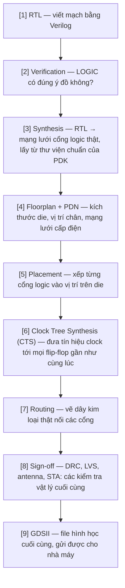

# Từ RTL đến chip thật — toàn cảnh quy trình thiết kế vi mạch

| | |
|---|---|
| **Chương trình** | HUFLIT Open Silicon (codename Vega) |
| **Ví dụ minh hoạ** | [`designs/counter3/`](../../designs/counter3/) — xem toàn bộ kết quả ở [`docs/counter3-technical-report.md`](../counter3-technical-report.md) (bản dịch: [`counter3-bao-cao-ky-thuat.md`](counter3-bao-cao-ky-thuat.md)) |
| **Đối tượng đọc** | Sinh viên/người mới muốn hiểu "chuyện gì vừa xảy ra" sau khi chạy một luồng LibreLane |
| **Bản gốc tiếng Anh** | [`docs/chip_making_a_to_z.md`](../chip_making_a_to_z.md) |
| **Trạng thái** | Tài liệu khái niệm — không phải một mốc chương trình, thuộc mục đích #2 của `docs/vi/` (xem [`README.md`](README.md)) |

## Vì sao có tài liệu này

Chạy lệnh `librelane -p sky130A -s sky130_fd_sc_hd config.yaml` rồi thấy
nó in ra "Flow complete" sau vài phút, tự nó không giải thích được **chuyện
gì vừa xảy ra**. Tài liệu này đi qua toàn bộ luồng RTL-to-GDSII theo khái
niệm, từng công đoạn một, bám vào số liệu thật của thiết kế đầu tiên của
chương trình (`counter3`, bộ đếm đồng bộ 3-bit) thay vì số liệu SGK chung
chung.

## 1. Toàn cảnh hành trình

Một cách hình dung dễ hiểu: **RTL** là bản vẽ ý tưởng ("nhà 2 tầng, mấy
phòng"). File **GDSII** cuối cùng là bản vẽ thi công chi tiết đến từng
viên gạch — đủ chính xác để thợ xây làm theo mà không cần hỏi lại gì
thêm. Toàn bộ hành trình ở giữa hai điểm này gọi là **physical design**,
hay **luồng RTL-to-GDSII**.

## 2. Một lệnh LibreLane thực chất chạy những gì

Lệnh `librelane -p sky130A -s sky130_fd_sc_hd config.yaml` chính là
**các bước [3] đến [9] ở trên, gộp thành một pipeline tự động**.
LibreLane không tự làm mọi việc — nó điều phối nhiều công cụ chuyên
biệt khác nhau, mỗi nhóm bước một công cụ:

| Nhóm bước | Công cụ thật đứng sau | Làm gì |
|---|---|---|
| Synthesis | **Yosys** | RTL → mạng lưới cổng logic |
| Floorplan / Placement / CTS / Routing | **OpenROAD** | Toàn bộ bố trí vật lý |
| Sign-off vật lý | **Magic + KLayout + Netgen** | Kiểm tra cuối cùng |

Với `counter3`, cả chuỗi này chạy trọn **76/76 bước con, 0 lỗi**, ra một
die 100µm × 100µm chứa 112 cell logic thật (3 flip-flop cho các bit đếm
cộng vài cổng tổ hợp), 616 "fill cell" (chỉ để lấp chỗ trống, không có
logic), và 90 tap/endcap cell (chống hiệu ứng latch-up). Mỗi bước bàn
giao một snapshot trạng thái thiết kế cho bước kế tiếp — đó là lý do
không cần can thiệp tay ở giữa.

## 3. "Verify RTL" không phải là "kiểm tra kết nối mạch" — hai tầng khác nhau

Đây là điểm quan trọng nhất cần phân biệt rõ: có **hai loại kiểm tra hoàn
toàn khác nhau**, xảy ra ở hai thời điểm khác nhau trong sơ đồ trên.

### (A) Verify RTL = kiểm tra LOGIC có đúng ý đồ không

Xảy ra ở bước [2], **trước khi** có bất kỳ hình dạng vật lý nào. Với
`counter3`: một testbench viết bằng Python (`cocotb`) giả lập tín hiệu
clock/reset, rồi assert "sau khi thả reset, `count` phải chạy đúng vòng
0→1→2→...→7→0". Đây thuần là kiểm tra ý nghĩa, chạy trong trình mô phỏng
(Verilator) — **chưa có hình dạng vật lý nào liên quan cả**. Bước này
từng bắt được một cái bẫy đáng nhớ: bản test đầu tiên thỉnh thoảng sai
không phải vì RTL sai, mà vì test giả định một tín hiệu vừa gán giá trị
sẽ có hiệu lực ngay ở cạnh xung clock kế tiếp — một chi tiết về cách
trình mô phỏng lập lịch, không phải bug RTL (chi tiết:
`docs/counter3-technical-report.md` §4.1). Bài học: **RTL đúng không có
nghĩa testbench viết đúng.**

### (B) "Kiểm tra kết nối mạch, xem vi phạm gì" — đây là bước [8], sau khi đã có layout vật lý

- **LVS (Layout Versus Schematic)** — so sánh "mạng lưới cổng logic định
  làm" (netlist) với "hình vừa vẽ ra" (layout) — có khớp 100% không, có
  dây nào bị thiếu/thừa/nối nhầm không.
- **DRC (Design Rule Check)** — kiểm tra hình học có tuân thủ luật vẽ của
  nhà máy không (ví dụ khoảng cách tối thiểu giữa hai đường kim loại, độ
  rộng tối thiểu...). Nhà máy chỉ chế tạo được layout hợp lệ theo luật
  của chính họ.
- **Antenna check** — một hiệu ứng vật lý riêng: trong lúc chế tạo, một
  đường kim loại dài chưa nối tới transistor có thể tích điện tĩnh, rồi
  khi phóng điện vào lớp oxit cổng mỏng manh của transistor sẽ làm hỏng
  nó. Kiểm tra này đảm bảo không có dây nào ở trạng thái "hớ hênh" đó.
- **STA (Static Timing Analysis)** — kiểm tra tốc độ: với tốc độ clock đã
  chọn (10ns = 100MHz cho `counter3`), tín hiệu có kịp chạy từ flip-flop
  này sang flip-flop kia trước khi xung clock tiếp theo tới không
  ("setup"), và có bị tới quá sớm làm hỏng giá trị trước đó không
  ("hold"). `counter3` dư tới +4.96ns setup margin — mạch chạy nhanh hơn
  100MHz rất nhiều; tốc độ này được chọn cố tình thấp để dễ pass ngay
  lần chạy đầu.

Cả 4 loại kiểm tra trên đều **0 vi phạm** với `counter3`.

## 4. Sản phẩm cuối cùng — GDSII — thực chất là gì

GDSII (`counter3.gds`, ~270KB) là một **file hình học thuần túy**: từng
lớp vật lý của chip (lớp diffusion, lớp poly, các lớp kim loại metal1/
metal2..., các lớp via) được mô tả bằng hàng ngàn đa giác, toạ độ chính
xác tới từng nanomet. Không còn khái niệm "logic" hay "Verilog" nào
trong file này nữa — nó thuần là hình học, giống một bản vẽ CAD cơ khí
cực kỳ chi tiết.

**Ý nghĩa:** đây là định dạng chuẩn công nghiệp mà **mọi nhà máy bán dẫn
(foundry) trên thế giới đều đọc được**, không phụ thuộc công cụ nào đã
tạo ra nó. Từ file này, nhà máy tạo ra các tấm **photomask** (một mặt nạ
quang học cho mỗi lớp vật lý), dùng trong quy trình quang khắc
(photolithography) để "in" từng lớp lên tấm wafer silicon thật.

## 5. Khi nào bản GDSII cuối cùng thật sự được gửi cho nhà máy để khắc chip?

**Câu trả lời ngắn cho chương trình này: chưa, và cố tình chưa làm.** Đây
là một quyết định đã ghi lại —
[`docs/decisions/ADR-OS-003-no-tapeout-first-12-months.md`](../decisions/ADR-OS-003-no-tapeout-first-12-months.md)
("không tape-out trong 12 tháng đầu"). Lý do: chạy trọn luồng RTL-to-GDSII
với sign-off đầy đủ, như `counter3` đã làm, đã cho **~90% giá trị học
tập** với chi phí gần bằng 0. Còn "tape-out" (gửi thật sang nhà máy) tốn
tiền thật và mất **9–14 tháng chờ** — chỉ đáng làm khi có một thiết kế
thật sự có giá trị cần chứng minh trên silicon, điều mà một bộ đếm 3-bit
rõ ràng không phải.

**Quy trình tape-out thật sự trông như thế nào**, để hình dung khi nào
chương trình sẽ tới bước đó:

1. Gửi file GDSII cho nhà máy (thường qua một **shuttle/MPW — Multi
   Project Wafer**, gộp nhiều thiết kế nhỏ của nhiều nhóm khác nhau vào
   chung một tấm wafer để chia chi phí, vì một tấm wafer đủ chỗ cho hàng
   trăm thiết kế nhỏ).
2. Nhà máy tạo mask và sản xuất wafer thật qua nhiều vòng quang khắc —
   mất vài tháng.
3. Cắt wafer thành từng die riêng, đóng gói (packaging).
4. Test bằng máy đo tự động (ATE), so kết quả đo trên silicon thật với
   những gì mô phỏng đã dự đoán.

Hệ sinh thái mã nguồn mở đã có sẵn vài lựa chọn chi phí thấp cho lúc
chương trình sẵn sàng cân nhắc bước này (khảo sát gần nhất tại ORConf
2026, tháng 9/2026): **IHP** có suất MPW miễn phí cho thiết kế mã nguồn
mở phi thương mại dưới 2mm² trên PDK SG13G2 của họ; **Tiny Tapeout** và
**wafer.space** (từ $2.000 cho 1.000 die, trên GF180MCU) là hai kênh
chia sẻ chi phí đang hoạt động. Không phải chuyện viển vông về nguyên
tắc — chỉ là chưa tới lúc.

## Bảng thuật ngữ Anh-Việt

| Thuật ngữ | Giải thích ngắn |
|---|---|
| RTL (Register-Transfer Level) | Mô tả mạch bằng ngôn ngữ phần cứng (Verilog/VHDL) ở mức các thanh ghi và phép toán giữa chúng |
| Synthesis (tổng hợp) | Dịch RTL thành mạng lưới cổng logic thật, lấy từ thư viện chuẩn (standard cell) của một PDK cụ thể |
| PDK (Process Design Kit) | Bộ quy tắc + thư viện của một nhà máy bán dẫn cụ thể, mô tả cách vẽ mạch hợp lệ trên công nghệ của họ |
| Standard cell | Một khối logic cơ bản đã được nhà máy thiết kế sẵn (AND, OR, flip-flop...), dùng lại nhiều lần |
| Floorplan | Bước xác định kích thước và hình dạng tổng thể của die, vị trí các khối lớn |
| PDN (Power Distribution Network) | Mạng lưới dây dẫn điện/đất phân phối nguồn cho toàn bộ chip |
| Placement | Xếp vị trí vật lý cho từng cell logic trên die |
| CTS (Clock Tree Synthesis) | Xây mạng phân phối tín hiệu clock sao cho tới mọi flip-flop gần như đồng thời |
| Routing | Vẽ dây kim loại thật nối các chân của các cell với nhau |
| DRC (Design Rule Check) | Kiểm tra hình học có tuân thủ luật vẽ tối thiểu của nhà máy không |
| LVS (Layout Versus Schematic) | Kiểm tra layout vật lý có khớp đúng với mạng lưới logic dự định không |
| Antenna check | Kiểm tra nguy cơ hỏng transistor do tích điện tĩnh trên dây kim loại chưa nối trong lúc chế tạo |
| STA (Static Timing Analysis) | Kiểm tra tốc độ: tín hiệu có kịp tới đích trước xung clock kế tiếp không (setup/hold) |
| Sign-off | Tập hợp các kiểm tra cuối cùng (DRC/LVS/antenna/STA...) trước khi coi thiết kế là hoàn chỉnh |
| GDSII | Định dạng file hình học chuẩn công nghiệp, mô tả layout cuối cùng để gửi nhà máy |
| Tape-out | Hành động gửi chính thức file thiết kế cuối cùng cho nhà máy để sản xuất |
| Shuttle / MPW (Multi Project Wafer) | Gộp nhiều thiết kế nhỏ của nhiều nhóm vào chung một tấm wafer để chia chi phí sản xuất |
| Foundry | Nhà máy sản xuất chip bán dẫn |
| Wafer | Tấm đĩa silicon tròn, nơi hàng trăm/ngàn con chip được chế tạo cùng lúc rồi cắt rời |
| Die | Một con chip đơn lẻ, sau khi cắt rời khỏi wafer |
| ATE (Automated Test Equipment) | Máy đo tự động dùng để kiểm tra chip thật sau khi sản xuất |

## Tham khảo

- `docs/counter3-technical-report.md` — ví dụ minh hoạ đầy đủ mà tài liệu
  này bám vào
- `docs/decisions/ADR-OS-001-librelane-not-openlane.md`,
  `ADR-OS-003-no-tapeout-first-12-months.md`
- `docs/OPEN_SILICON_KICKOFF.md` §2.1 (công cụ), §2.2 (PDK), §5.2/§5.3
  (hạ tầng)
- LibreLane documentation: `librelane.readthedocs.io`
- cocotb documentation: `docs.cocotb.org`
