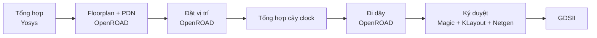

# counter3 — Thiết kế RTL-to-GDSII đầu tiên: Báo cáo kỹ thuật

> Tài liệu học tập nguyên bản tiếng Việt (mục đích #2 của `docs/vi/README.md`)
> — không bắt buộc gửi upstream. Bản gốc tiếng Anh (tài sản chính thức của
> chương trình): [`docs/counter3-technical-report.md`](../counter3-technical-report.md).

| | |
|---|---|
| **Chương trình** | HUFLIT Open Silicon (mật danh Vega) |
| **Thiết kế** | [`designs/counter3/`](../../designs/counter3/) |
| **Mốc** | Giai đoạn 0, tuần 3-6 (`docs/OPEN_SILICON_KICKOFF.md` §4) |
| **Ngày chạy** | 2026-09-14 |
| **Trạng thái** | Hoàn tất ký duyệt đầy đủ DRC/LVS/timing. Không nộp shuttle (ADR-OS-003) |
| **Đối tượng đọc** | Tài liệu giảng dạy — ví dụ thực hành đầu tiên của luồng RTL-to-GDSII trong chương trình |

## Tóm tắt

Tài liệu này ghi lại thiết kế đầu tiên chạy trọn luồng RTL-to-GDSII trong
chương trình HUFLIT Open Silicon: `counter3`, một bộ đếm lên đồng bộ 3-bit.
Bản thân thiết kế cố tình rất đơn giản — theo lộ trình Giai đoạn 0, trọng
tâm không nằm ở bộ đếm mà ở **mọi thứ xung quanh nó**: viết testbench đúng,
điều khiển một công cụ physical design mã nguồn mở (LibreLane) đến khi ký
duyệt sạch, và hiểu vì sao **ký duyệt (sign-off)** — chứ không phải RTL hay
tổng hợp (synthesis) — mới là phần khó nhất của thiết kế chip. Tài liệu đi
qua: thiết kế RTL, phương pháp kiểm thử (verification), luồng physical
implementation, kết quả số liệu, và ba vấn đề không hiển nhiên gặp phải
trên đường đi, mỗi vấn đề kèm nguyên nhân gốc và cách sửa. Viết cho người
kế tiếp (hoặc sinh viên) sẽ lặp lại bài thực hành này.

## 1. Mục đích và bối cảnh

Giai đoạn 0 của chương trình (`docs/OPEN_SILICON_KICKOFF.md` §4) xác thực
một người qua ba nấc kỹ năng trước khi mở rộng quy mô:

1. **Tuần 1-2** — cài toolchain, chạy smoke test. (Đã xong — xem `backlog.md`.)
2. **Tuần 3-6** — tự viết một thiết kế nhỏ, chạy **trọn** luồng với ký
   duyệt đầy đủ DRC, LVS, timing. Không nộp shuttle. **Đây là nội dung
   tài liệu này.**
3. **Tuần 7-12** — chọn một IP mã nguồn mở thiếu verification, viết
   testbench cocotb, tìm một lỗi thật, gửi PR được merge ngược dòng
   (upstream). Đây là Cổng 0 (Gate 0).

Mục tiêu tường minh của bước 2 là hiểu **vì sao ký duyệt là phần khó
nhất**, không phải để tạo ra một mạch hữu ích. Một bộ đếm 3-bit không có
giá trị kỹ thuật riêng; giá trị của nó ở đây hoàn toàn mang tính sư phạm.
Đây cũng là lý do kết quả GDSII chỉ được giữ làm bằng chứng cục bộ, không
bao giờ nộp shuttle (ADR-OS-003) — kinh tế học của tape-out chỉ hợp lý khi
một thiết kế có giá trị thật cần chứng minh trên silicon.

## 2. Toolchain và môi trường

| Thành phần | Vai trò |
|---|---|
| **IIC-OSIC-TOOLS** (Docker, ĐH Linz) | Container đóng gói toàn bộ chuỗi công cụ EDA mã nguồn mở dùng bên dưới |
| **Verilator** | Trình mô phỏng RTL |
| **cocotb** | Framework testbench bằng Python, dùng luồng Makefile cổ điển |
| **LibreLane** (v3.1.0.dev3) | Luồng RTL-to-GDSII, do FOSSi Foundation fork từ OpenLane (xem ADR-OS-001) |
| **SKY130A** (`sky130_fd_sc_hd`) | PDK mở và thư viện standard cell (ô chuẩn) dùng cho lần chạy này |

LibreLane mô hình hóa một thiết kế thành chuỗi **Step** (bước) hợp thành
**Flow** (luồng), mỗi bước biến đổi một **State** (trạng thái — snapshot
của mọi view thiết kế: netlist, def, sdc, spef, v.v.) rồi chuyển cho bước
sau. Cấu hình của từng bước được chụp lại trong snapshot đó, nên cùng một
config cộng cùng phiên bản công cụ được kỳ vọng tái lập ra đúng kết quả,
từng bit một. Đây là lý do repo commit `config.yaml` và mã RTL, nhưng
**không** commit thư mục `runs/`: lần chạy được tái tạo lại từ config, chứ
không lưu như một tài sản nhị phân (xem `.gitignore`).

**Cạm bẫy cần lưu ý ngay từ đầu:** biến môi trường PDK mặc định trong
container là `ihp-sg13g2`, **không phải** `sky130A`, bất kể `config.yaml`
của thiết kế có yêu cầu gì dưới khối `pdk::sky130*:`. Các override đó bị
bỏ qua âm thầm nếu PDK đang hoạt động sai — không cảnh báo, không báo lỗi.
Luồng phải được gọi với PDK được chỉ định tường minh trên dòng lệnh:

```bash
docker compose -f docker/docker-compose.yml run --rm \
  --workdir /workspace/designs/counter3 \
  librelane-dev --skip \
  librelane -p sky130A -s sky130_fd_sc_hd config.yaml
```

Xem mục 6 để có đầy đủ các bước tái lập, và
[`wiki/docker-toolchain-invocation.md`](../../wiki/docker-toolchain-invocation.md)
để biết thêm chi tiết cách gọi container.

## 3. Thiết kế RTL

Thiết kế đang xét,
[`designs/counter3/src/counter3.v`](../../designs/counter3/src/counter3.v):

```verilog
// 3-bit synchronous up-counter, synchronous active-high reset.
module counter3 (
    input  wire       clk,
    input  wire       rst,
    output reg  [2:0] count
);

    always @(posedge clk) begin
        if (rst)
            count <= 3'b000;
        else
            count <= count + 3'b001;
    end

endmodule
```

Hai lựa chọn thiết kế đáng nêu tường minh — vì đây là loại quyết định mà
sinh viên nên tập thói quen phát biểu rõ ràng thay vì để ngầm định:

- **Reset đồng bộ (synchronous), không phải bất đồng bộ.** `rst` được lấy
  mẫu tại cạnh clock giống như mọi input khác. Đây thường là phong cách
  được ưu tiên trong luồng ASIC (tránh tạo thêm một đường thời gian thứ
  hai không được clock cho việc nhả reset), đổi lại reset chỉ có tác dụng
  khi clock đang chạy — điều này liên quan trực tiếp đến mục 4.
- **Wrap-around miễn phí nhờ tràn số.** `count` là thanh ghi 3-bit;
  `count + 3'b001` khi `count == 3'b111` tràn và bị cắt về `3'b000` mà
  không cần nhánh xử lý wrap-around tường minh. Cơ chế này dựa vào việc
  Verilog cắt kết quả theo độ rộng cố định (fixed-width truncation), và
  đáng nói vì đây chính xác là điểm dễ sai nếu thanh ghi rộng hơn hoặc có
  dấu (signed).

## 4. Kiểm thử (Verification)

Testbench,
[`designs/counter3/verify/test_counter3.py`](../../designs/counter3/verify/test_counter3.py),
dùng luồng Makefile cổ điển của cocotb chạy trên Verilator:

```
# designs/counter3/verify/Makefile
SIM ?= verilator
TOPLEVEL_LANG ?= verilog
VERILOG_SOURCES = $(shell pwd)/../src/counter3.v
TOPLEVEL = counter3
MODULE = test_counter3
include $(shell cocotb-config --makefiles)/Makefile.sim
```

Hai test được viết:

1. **`test_reset_clears_count`** — giữ `rst` ở mức cao trong hai cạnh
   clock, khẳng định `count == 0` trong lúc đó.
2. **`test_counts_and_wraps`** — nhả reset, sau đó kiểm tra 16 cạnh clock
   liên tiếp: giá trị mỗi chu kỳ phải bằng `(giá trị trước + 1) mod 8`.
   16 chu kỳ gấp đôi chu kỳ của bộ đếm nên test này chạm hiện tượng
   wrap-around từ 7 về 0 ít nhất hai lần, không phải ngẫu nhiên một lần.

Cả hai test đều pass (2/2). Bản thân việc thiết kế và kiểm thử một mạch
nhỏ như thế này bình thường không đáng viết chi tiết — trừ việc cấu trúc
của test thứ hai chứa một bài học phương pháp luận thật sự, trình bày ở
mục kế tiếp.

### 4.1 Một cạm bẫy về thời điểm (timing) của trình mô phỏng

Phiên bản đầu tiên của `test_counts_and_wraps` khẳng định một điều
**tuyệt đối**: "count bằng 1 ở cạnh clock đầu tiên sau khi nhả reset."
Khẳng định đó fail không đều đặn (intermittently) — không phải vì RTL sai,
mà vì cách viết testbench. Hàm hỗ trợ reset nhả `rst` ngay sau một `await
RisingEdge(dut.clk)`:

```python
dut.rst.value = 0
await RisingEdge(dut.clk)
```

Việc gán giá trị (`.value`) cho một tín hiệu ngay sau `await
RisingEdge(...)` **không được đảm bảo là DUT sẽ thấy được giá trị đó ngay
ở cạnh clock kế tiếp** — số delta-cycle chính xác trước khi một giá trị
được driven lan truyền đi là một chi tiết lập lịch (scheduling) ở tầng
trình mô phỏng, không phải điều mà RTL hay người viết testbench kiểm soát
trực tiếp. Coi "một chu kỳ sau khi tôi gán giá trị này" là một đảm bảo
chắc chắn đã tạo ra lỗi off-by-one trông giống lỗi RTL nhưng không phải.

**Cách sửa:** viết lại khẳng định theo kiểu **tự tham chiếu**
(self-referential) — giá trị kỳ vọng mỗi chu kỳ được suy ra từ giá trị
**đã quan sát được ở chu kỳ trước**, thay vì dựa vào một số chu kỳ tuyệt
đối gắn với đúng thời điểm giả định reset có hiệu lực:

```python
previous = int(dut.count.value)
for _ in range(16):
    await RisingEdge(dut.clk)
    current = int(dut.count.value)
    expected = (previous + 1) % 8
    assert current == expected, f"expected {expected} after {previous}, got {current}"
    previous = current
```

**Bài học sư phạm:** khi giả định về thời gian trong một test cocotb và
hành vi thực tế của RTL không khớp nhau, đừng vội cho rằng RTL sai. Kiểm
tra xem test có đang khẳng định một điều về **lập lịch của trình mô
phỏng** thay vì về **hành vi logic của thiết kế** hay không, và ưu tiên
khẳng định tương đối theo một điểm mốc đã quan sát được thay vì khẳng định
gắn với một số chu kỳ tuyệt đối giả định trước.

## 5. Triển khai vật lý (LibreLane)

Toàn bộ cấu hình,
[`designs/counter3/config.yaml`](../../designs/counter3/config.yaml):

```yaml
# Basics
DESIGN_NAME: counter3
VERILOG_FILES: dir::src/*.v
CLOCK_PERIOD: 10
CLOCK_PORT: clk

# Floorplan
FP_SIZING: absolute
DIE_AREA: [0, 0, 100, 100]

# PDN
PDN_VOFFSET: 5
PDN_HOFFSET: 5
PDN_VWIDTH: 2
PDN_HWIDTH: 2
PDN_VPITCH: 30
PDN_HPITCH: 30
PDN_SKIPTRIM: true

# Technology-Specific Configs
pdk::sky130*:
  CLOCK_PERIOD: 10.0
```

Ba dòng đáng giải thích thêm ngoài comment trong config:

- `VERILOG_FILES: dir::src/*.v` dùng tiền tố glob `dir::` của LibreLane,
  được phân giải tương đối với thư mục chứa file config — lấy mọi file
  `.v` dưới `src/` mà không cần liệt kê từng file.
- `CLOCK_PERIOD: 10` đặt chu kỳ clock mục tiêu 10 ns (100 MHz). Đây là
  mục tiêu cố tình bảo thủ (conservative) cho một thiết kế nhỏ như thế
  này; mục 6 cho thấy còn bao nhiêu dư địa timing (margin) chưa dùng tới.
- Khối `pdk::sky130*:` là cơ chế override theo PDK của LibreLane — hữu ích
  khi một config phải hỗ trợ nhiều hơn một PDK, dù trong trường hợp này nó
  chỉ lặp lại đúng chu kỳ clock đã đặt ở trên.

### 5.1 Vì sao khối floorplan và PDN không dùng giá trị mặc định

Mọi thứ phía trên comment `# Floorplan` gần như là một config LibreLane
tối giản. Mọi thứ từ `FP_SIZING` trở đi tồn tại vì **một thiết kế nhỏ như
thế này phá vỡ cách tính kích thước floorplan mặc định (theo phần trăm)
của LibreLane.** `FP_CORE_UTIL` (chế độ sizing mặc định) tính diện tích
die theo phần trăm tổng diện tích các cell. Với một nhúm flip-flop và
gate, die tính ra theo cách đó quá nhỏ một khi mạng phân phối nguồn (PDN —
power distribution network) cần dây strap và các buffer sửa hold sau
clock-tree-synthesis cần chỗ đặt. Nếu giữ mặc định, luồng fail ở hai bước,
theo đúng thứ tự này:

1. **`PDN-0185`** ("insufficient width to add straps" — không đủ độ rộng
   để thêm strap) ở bước sinh PDN.
2. Nếu chỉ vá lỗi #1 mà không xử lý nguyên nhân gốc: **`DPL-0036`**
   ("detailed placement failed" — đặt chi tiết thất bại) xảy ra sau đó,
   khi resizer cố chèn buffer sửa hold và không tìm được chỗ hợp lệ.

**Cách sửa:** chuyển sang `FP_SIZING: absolute` với `DIE_AREA` được đặt
dư dả (`[0, 0, 100, 100]`, tức 100 µm × 100 µm — xem mục 6 để biết layout
kết quả thưa đến mức nào), cộng với việc nới rộng mẫu strap PDN
(`PDN_V/HOFFSET`, `PDN_V/HWIDTH`, `PDN_V/HPITCH`, `PDN_SKIPTRIM: true`).
Đây chính là các giá trị non-default mà ví dụ `spm` đi kèm LibreLane cũng
dùng, vì cùng một lý do: `spm` cũng đủ nhỏ để gặp lớp vấn đề này. Một cạm
bẫy cú pháp trên đường đi: `DIE_AREA` phải là **list** kiểu YAML, không
phải chuỗi có dấu ngoặc kép — chuỗi bị LibreLane từ chối tường minh
("Refusing to automatically convert string at 'DIE_AREA' to list"). Bài
viết đầy đủ:
[`wiki/librelane-config-for-tiny-designs.md`](../../wiki/librelane-config-for-tiny-designs.md).

### 5.2 Các bước của luồng (flow stages)

Lần chạy tạo ra kết quả bên dưới (`RUN_2026-09-14_18-09-59`) hoàn tất
**76/76 bước của luồng, không lỗi nào**. Nhóm theo giai đoạn:



Ký duyệt (giai đoạn cuối) là nơi chạy các kiểm tra DRC, LVS, XOR, và
antenna — xem kết quả ở mục 6.

## 6. Kết quả

Các số liệu bên dưới lấy trực tiếp từ
`designs/counter3/runs/RUN_2026-09-14_18-09-59/final/metrics.json` (không
commit — tái tạo bằng cách chạy lại luồng theo mục 7).

### 6.1 Số lượng cell và diện tích

| Chỉ số | Giá trị |
|---|---|
| Số bước hoàn tất | 76 / 76, 0 lỗi |
| Standard cell chức năng | 112 (3 tuần tự + 6 tổ hợp + buffer clock/hold) |
| Sequential cell (flip-flop của bộ đếm) | 3 |
| Combinational cell | 6 |
| Clock buffer được chèn thêm | 4 |
| Hold-fix buffer được chèn thêm | 5 |
| Fill cell (lấp mật độ, không mang logic) | 616 |
| Tap/endcap cell (chống latch-up) | 90 |
| Diện tích die | 100 µm × 100 µm (10.000 µm²) |
| Diện tích core | 6.761,48 µm² |
| Độ lấp đầy (utilization) của core | 5,24% |

Con số utilization là minh họa rõ nhất cho bài học ở mục 5.1: ở mức
utilization 5,24%, phần lớn diện tích die để trống có chủ đích — dành cho
dư địa PDN và đi dây buffer mà ba flip-flop này không thật sự cần. Riêng
fill cell (616 trong tổng 728 instance được đặt) đã nhiều hơn logic thật
sự (112 cell) hơn 5 lần; ngoài ra còn 90 tap/endcap cell nữa nằm trong
layout, được tính như một chỉ số riêng chứ không gộp vào tổng 728 đó.

### 6.2 Timing và công suất

| Chỉ số | Giá trị |
|---|---|
| Chu kỳ clock mục tiêu | 10 ns (100 MHz) |
| Setup slack xấu nhất (trên mọi PVT corner) | +4,96 ns (đạt) |
| Hold slack xấu nhất (trên mọi PVT corner) | +0,41 ns (đạt) |
| Vi phạm setup / hold | 0 / 0 |
| Vi phạm max slew / max cap / max fanout | 0 / 0 / 0 |
| Tổng công suất (corner danh định, 25 °C, 1,8 V) | ≈ 96,9 nW |
| — công suất internal | ≈ 79,3 nW |
| — công suất switching | ≈ 17,5 nW |
| — công suất leakage | ≈ 2,4 pW (không đáng kể) |

Chín PVT corner (kết hợp process/điện áp/nhiệt độ) được kiểm tra; cả chín
đều báo 0 vi phạm setup và hold. Gần 5 ns dư địa setup ở chu kỳ 10 ns là
điều dự tính trước: 100 MHz là mục tiêu bảo thủ được chọn để ký duyệt dễ
dàng ở lần chạy đầu tiên, không phải giới hạn mà thiết kế này bị đẩy tới.

### 6.3 Đi dây và ký duyệt

| Kiểm tra | Kết quả |
|---|---|
| Wirelength / via (global route) | 607 / 121 |
| Wirelength / via (detailed route) | 366 / 111 |
| Lỗi DRC ở bước routing chi tiết | 0 |
| Lỗi Magic DRC | 0 |
| Lỗi KLayout DRC | 0 |
| Lỗi chồng lấn (illegal overlap) Magic | 0 |
| Khác biệt XOR (GDS so với layout) | 0 |
| Lỗi LVS (schematic so với layout) | 0 |
| Vi phạm antenna | 0 |

Mọi bộ kiểm tra ký duyệt trong log của luồng đều báo sạch, theo đúng thứ
tự: XOR sạch → Magic DRC sạch → KLayout DRC sạch → illegal-overlap sạch →
LVS sạch → không vi phạm setup → không vi phạm hold → không vi phạm max
slew → không vi phạm max cap. File GDSII cuối cùng
(`designs/counter3/runs/.../final/gds/counter3.gds`, ~270 KB) chỉ được
giữ làm bằng chứng cục bộ — bị gitignore, không phải tài sản nộp shuttle
(ADR-OS-003).

## 7. Bài học cho thiết kế tiếp theo

Ba vấn đề cụ thể, không hiển nhiên, đã gặp và được xử lý trong quá trình
tạo ra kết quả này. Mỗi vấn đề được ghi đầy đủ trong `wiki/` để thiết kế
tiếp theo không lặp lại cùng một quá trình dò-và-sửa:

| # | Triệu chứng | Nguyên nhân gốc | Cách sửa |
|---|---|---|---|
| 1 | Config sky130 bị bỏ qua âm thầm; dùng sai thư viện công nghệ | `$PDK` mặc định trong container là `ihp-sg13g2`, không phải `sky130A` | Truyền tường minh `-p sky130A -s sky130_fd_sc_hd` trên CLI, không dựa vào mặc định |
| 2 | Lỗi `PDN-0185` rồi `DPL-0036` | Sizing floorplan mặc định (theo %) quá nhỏ cho thiết kế tí hon một khi PDN strap + hold buffer cần chỗ | `FP_SIZING: absolute` + `DIE_AREA` tường minh, cộng tuning PDN (mục 5.1) |
| 3 | Test cocotb fail off-by-one không đều đặn sau khi nhả reset | Gán giá trị tín hiệu ngay sau `await RisingEdge(...)` không đảm bảo thấy được ở cạnh kế tiếp (lập lịch trình mô phỏng, không phải lỗi RTL) | Viết khẳng định tương đối theo chu kỳ trước, không theo số chu kỳ tuyệt đối |

Mẫu hình chung đứng sau vấn đề #1 và #2: **luồng không fail ngay và ồn ào
khi một giả định được tinh chỉnh cho thiết kế cỡ thông thường bị phá vỡ
trên một thiết kế bất thường — nó fail vài bước sau đó, với một thông báo
lỗi không trỏ rõ về nguyên nhân thật.** Đọc đúng bước mà một step thất
bại, thay vì chỉ đọc thông báo lỗi ở tầng trên cùng, chính là kỹ năng
debug mà bài thực hành này muốn xây dựng.

## 8. Tái lập kết quả

```bash
# 1. Build image toolchain (một lần)
docker compose -f docker/docker-compose.yml build

# 2. Chạy testbench cocotb
docker compose -f docker/docker-compose.yml run --rm \
  --workdir /workspace/designs/counter3/verify \
  librelane-dev --skip make

# 3. Chạy trọn luồng LibreLane (PDK phải tường minh -- xem mục 2)
docker compose -f docker/docker-compose.yml run --rm \
  --workdir /workspace/designs/counter3 \
  librelane-dev --skip \
  librelane -p sky130A -s sky130_fd_sc_hd config.yaml

# 4. Kiểm tra kết quả
ls designs/counter3/runs/RUN_*/final/gds/
cat designs/counter3/runs/RUN_*/final/metrics.json
```

Thư mục `runs/` tạo ra bị gitignore có chủ đích: `config.yaml` và RTL mới
là nguồn sự thật để tái lập, không phải các file nhị phân sinh ra (xem
phần nguyên tắc layout repo trong [`README.md`](../../README.md)).

## 9. Liên hệ với lộ trình chương trình

Kết quả này khép lại tuần 3-6 của Giai đoạn 0
(`docs/OPEN_SILICON_KICKOFF.md` §4). `counter3` có thể là thiết kế học tập
nhỏ đầu tiên trong số vài thiết kế — UART là cái tên kia được kickoff doc
nhắc tới — nhưng một mình nó đã đủ để thỏa mãn deliverable tuần 3-6. Mốc
tiếp theo, tuần 7-12, mới là Cổng 0 (Gate 0) thật sự: chọn một IP mã nguồn
mở, viết testbench cocotb, tìm một lỗi thật, và có một PR được merge
ngược dòng trước 2026-12-13. Xem `backlog.md` để biết tiến độ hiện tại so
với cổng đó.

## Bảng thuật ngữ Anh-Việt (EDA / verification)

| Tiếng Anh | Tiếng Việt / giải thích ngắn |
|---|---|
| sign-off | ký duyệt — bước xác nhận cuối cùng thiết kế đạt mọi tiêu chí (DRC, LVS, timing) trước khi coi là hoàn tất |
| floorplan | quy hoạch mặt bằng — bước định hình kích thước, vị trí die/core và các khối lớn |
| standard cell | ô chuẩn — cell logic cơ bản (cổng, flip-flop) trong thư viện công nghệ |
| PDN (power distribution network) | mạng phân phối nguồn — hệ thống dây strap cấp nguồn/đất cho toàn chip |
| static timing analysis (STA) | phân tích thời gian tĩnh — kiểm tra timing không cần mô phỏng động |
| setup / hold violation | vi phạm setup / hold — dữ liệu đến trễ/sớm hơn giới hạn cho phép quanh cạnh clock |
| slack | dư địa (thời gian) — chênh lệch giữa yêu cầu timing và thực tế đạt được |
| DRC (design rule check) | kiểm tra quy tắc thiết kế — xác nhận layout tuân thủ luật hình học của quy trình chế tạo |
| LVS (layout vs. schematic) | so khớp mạch-layout — xác nhận layout khớp đúng với mạch/netlist |
| antenna violation | vi phạm antenna — nguy cơ tích tụ điện tích plasma làm hỏng cổng transistor trong quá trình khắc (etching) |
| utilization | độ lấp đầy — tỷ lệ diện tích thực sự dùng cho cell trên tổng diện tích core |
| wirelength | độ dài dây nối (đi dây) |
| buffer | bộ đệm — cell chèn thêm để khuếch đại tín hiệu hoặc sửa timing |
| tape-out | nộp shuttle / gửi sản xuất — bước gửi thiết kế đi chế tạo thật |

## Changelog

| Phiên bản | Ngày | Thay đổi |
|---|---|---|
| v1.0 | 2026-09-15 | Bản đầu tiên, viết sau lần chạy ngày 2026-09-14, phỏng theo bản tiếng Anh `docs/counter3-technical-report.md`. |
