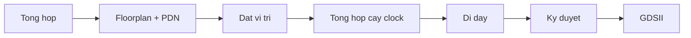

# counter3

**Thiết kế RTL-to-GDSII đầu tiên**

HUFLIT Open Silicon (Vega) — Giai đoạn 0, tuần 3-6
Báo cáo đầy đủ: `docs/vi/counter3-bao-cao-ky-thuat.md`

---

## Vì sao có bài thực hành này

- Nấc kỹ năng Giai đoạn 0 (`docs/OPEN_SILICON_KICKOFF.md` §4):
  1. Tuần 1-2 — smoke test toolchain (xong)
  2. **Tuần 3-6 — trọn luồng RTL-to-GDSII, tự thiết kế (bài này)**
  3. Tuần 7-12 — PR thật lên upstream (Cổng 0)
- Mục tiêu: hiểu **vì sao ký duyệt (sign-off) là phần khó nhất**, không
  phải để tạo ra một mạch hữu ích.
- Không nộp shuttle (ADR-OS-003) — GDSII chỉ là bằng chứng học tập.

---

## Toolchain

| Thành phần | Vai trò |
|---|---|
| IIC-OSIC-TOOLS (Docker) | Đóng gói toàn bộ chuỗi công cụ EDA mã nguồn mở |
| Verilator + cocotb | Mô phỏng RTL, testbench Python |
| LibreLane v3.1.0.dev3 | Luồng RTL -> GDSII (Step -> Flow -> State) |
| SKY130A / `sky130_fd_sc_hd` | PDK mở + thư viện standard cell |

**Cạm bẫy:** `$PDK` mặc định trong container là `ihp-sg13g2`, không phải
sky130A -- luôn truyền tường minh `-p sky130A -s sky130_fd_sc_hd`.

---

## Thiết kế

```verilog
module counter3 (
    input  wire       clk,
    input  wire       rst,
    output reg  [2:0] count
);
    always @(posedge clk) begin
        if (rst)
            count <= 3'b000;
        else
            count <= count + 3'b001;
    end
endmodule
```

Reset đồng bộ. Wrap-around miễn phí (tràn số 3-bit bị cắt).

---

## Kiểm thử: cocotb + Verilator

Hai test:

1. `test_reset_clears_count` -- count bằng 0 khi `rst` đang giữ mức cao.
2. `test_counts_and_wraps` -- 16 chu kỳ, mỗi chu kỳ so với giá trị
   **trước đó**: `expected = (previous + 1) % 8`.

**Kết quả: 2/2 pass.**

---

## Cạm bẫy #1 -- Off-by-one không phải lỗi RTL

- Bản đầu khẳng định **tuyệt đối**: "count == 1 ở cạnh clock đầu tiên
  sau khi nhả reset."
- Fail không đều đặn -- không phải lỗi RTL.
- `dut.rst.value = 0` ngay sau `await RisingEdge(...)` **không đảm bảo**
  DUT thấy được ở cạnh kế tiếp (lập lịch của trình mô phỏng).
- **Cách sửa:** khẳng định tương đối theo giá trị **quan sát được ở chu
  kỳ trước**, không theo số chu kỳ tuyệt đối.

---

## Config vật lý: phần tối giản

```yaml
DESIGN_NAME: counter3
VERILOG_FILES: dir::src/*.v
CLOCK_PERIOD: 10        # 10 ns = 100 MHz, cố tình bảo thủ
CLOCK_PORT: clk
```

Mọi thứ sau đây đều không dùng mặc định -- vì một lý do duy nhất: **thiết
kế quá nhỏ so với mặc định của LibreLane.**

---

## Cạm bẫy #2 -- Sizing floorplan/PDN cho thiết kế tí hon

Sizing mặc định theo phần trăm (`FP_CORE_UTIL`) tính ra die quá nhỏ cho
một nhúm cell một khi PDN strap + hold buffer cần chỗ:

1. `PDN-0185` -- không đủ độ rộng strap
2. `DPL-0036` -- đặt chi tiết thất bại (nếu chỉ vá lỗi #1)

**Cách sửa:**

```yaml
FP_SIZING: absolute
DIE_AREA: [0, 0, 100, 100]
PDN_VOFFSET: 5
PDN_HOFFSET: 5
PDN_VWIDTH: 2
PDN_HWIDTH: 2
PDN_VPITCH: 30
PDN_HPITCH: 30
PDN_SKIPTRIM: true
```

Đúng các giá trị mà ví dụ `spm` của LibreLane cũng dùng, cùng lý do.

---

## Luồng: 76/76 bước, 0 lỗi



---

## Kết quả -- Cell & diện tích

| Chỉ số | Giá trị |
|---|---|
| Standard cell chức năng | 112 (3 tuần tự + 6 tổ hợp + buffer) |
| Fill / tap cell | 616 / 90 |
| Diện tích die | 100 x 100 um (10.000 um^2) |
| Độ lấp đầy core | **5,24%** |

Riêng fill cell (616/728 instance được đặt) đã nhiều hơn logic (112) gấp
5 lần; thêm 90 tap/endcap cell nữa, được tính riêng. Die được sizing cho
dư địa PDN, không phải cho ba flip-flop này.

---

## Kết quả -- Timing & công suất

| Chỉ số | Giá trị |
|---|---|
| Clock mục tiêu | 10 ns (100 MHz) |
| Setup slack xấu nhất (9 PVT corner) | +4,96 ns (đạt) |
| Hold slack xấu nhất (9 PVT corner) | +0,41 ns (đạt) |
| Vi phạm setup / hold | 0 / 0 |
| Tổng công suất (corner danh định) | ≈ 96,9 nW |

~5 ns dư địa setup ở chu kỳ 10 ns: 100 MHz là mục tiêu bảo thủ, không
phải giới hạn thiết kế bị đẩy tới.

---

## Kết quả -- Ký duyệt

| Kiểm tra | Kết quả |
|---|---|
| Magic DRC / KLayout DRC | 0 lỗi |
| XOR (GDS so với layout) | 0 khác biệt |
| LVS | 0 lỗi |
| Vi phạm antenna | 0 |

Mọi bộ kiểm tra trong log của luồng: **sạch.**

---

## Ba bài học cho thiết kế tiếp theo

| # | Triệu chứng | Nguyên nhân gốc | Cách sửa |
|---|---|---|---|
| 1 | Config sky130 bị bỏ qua | `$PDK` mặc định = ihp-sg13g2 | Truyền tường minh `-p sky130A -s sky130_fd_sc_hd` |
| 2 | `PDN-0185` -> `DPL-0036` | Sizing mặc định quá nhỏ cho thiết kế tí hon | `FP_SIZING: absolute` + PDN đã tuning |
| 3 | Test fail off-by-one | Gán tín hiệu sau await không thấy ngay ở cạnh kế tiếp | Khẳng định tương đối theo chu kỳ trước |

**Mẫu hình chung:** luồng fail *vài bước sau* nguyên nhân thật, với lỗi
không trỏ rõ về gốc rễ.

---

## Tái lập kết quả

```bash
docker compose -f docker/docker-compose.yml build
docker compose -f docker/docker-compose.yml run --rm \
  --workdir /workspace/designs/counter3/verify \
  librelane-dev --skip make
docker compose -f docker/docker-compose.yml run --rm \
  --workdir /workspace/designs/counter3 \
  librelane-dev --skip \
  librelane -p sky130A -s sky130_fd_sc_hd config.yaml
```

`runs/` bị gitignore -- `config.yaml` + RTL mới là nguồn sự thật.

---

## Vị trí trong lộ trình chương trình

- Khép lại **tuần 3-6** của Giai đoạn 0.
- Tiếp theo: **tuần 7-12**, Cổng 0 thật sự -- một PR merge upstream
  trước 2026-12-13.
- Chi tiết đầy đủ: `docs/vi/counter3-bao-cao-ky-thuat.md`, `backlog.md`.

---

## Hỏi đáp

`docs/vi/counter3-bao-cao-ky-thuat.md` — báo cáo đầy đủ
`wiki/librelane-config-for-tiny-designs.md` — chi tiết floorplan/PDN
`wiki/docker-toolchain-invocation.md` — chi tiết gọi container
